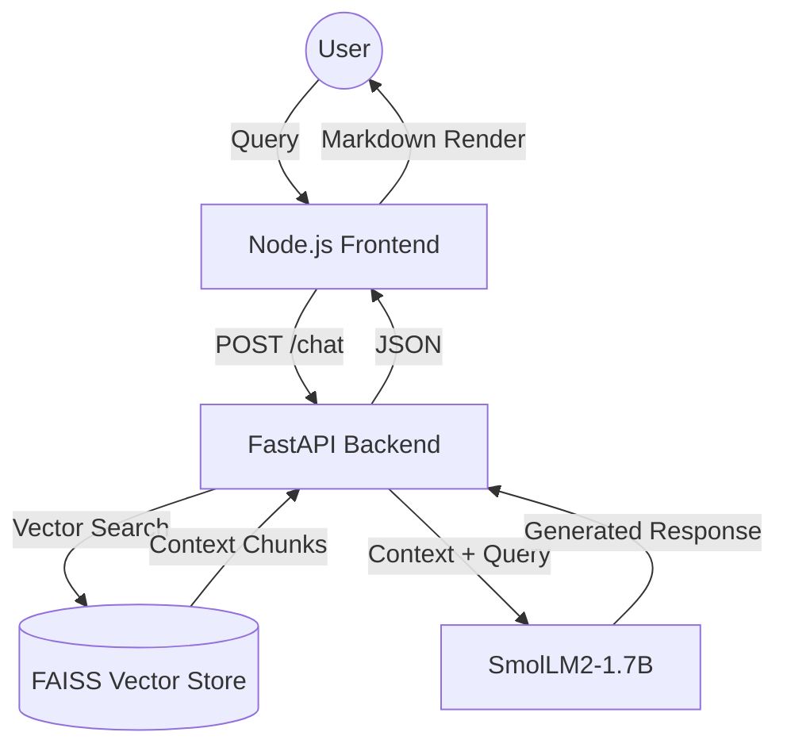

# 10 Project Overview

The **Nexira Multi-PDF IT Assistant** is a production-grade **Retrieval-Augmented Generation (RAG)** system.

## 📊 System Flow Diagram

## 🎯 Primary Objectives
- **Zero Hallucination:** Constrained generation using strict system prompts.
- **Accessibility:** Industry-standard ChatGPT user experience.
- **Efficiency:** Deployment on consumer-grade hardware.

---
[[00 Index|🏠 Back to Home]]
