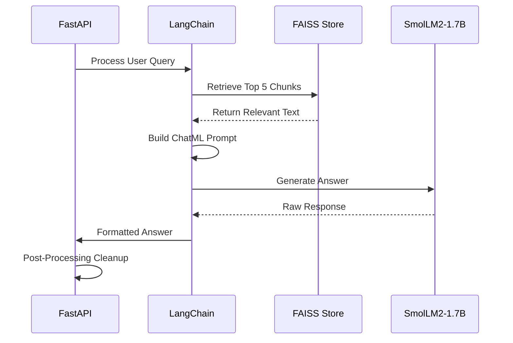

# 30 Backend Architecture

The backend (`app.py`) is the core intelligence hub.

## 🧠 LLM Interaction Flow

## 🛠️ FastAPI Configuration
- **Port:** 8000
- **CORS:** Enabled for Port 3000
- **Inference:** CUDA-aware (float16)

---
[[00 Index|🏠 Back to Home]]
[[70 CI-CD Pipeline]]
[[60 Data Ingestion]]
[[40 Frontend Architecture]]
[[10 Project Overview]]

