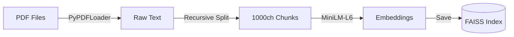

# 60 Data Ingestion

## 📥 Pipeline Overview

```mermaid
graph LR
    PDF[PDF Files] -->|PyPDFLoader| Text[Raw Text]
    Text -->|Recursive Split| Chunks[1000ch Chunks]
    Chunks -->|MiniLM-L6| Vectors[Embeddings]
    Vectors -->|Save| FAISS[(FAISS Index)]
```

- **Chunk Size:** 1000
- **Overlap:** 200
- **Model:** `all-MiniLM-L6-v2`

---
[[00 Index|🏠 Back to Home]]
