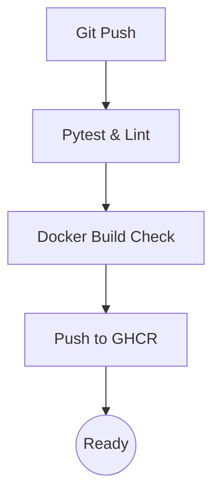

# 70 CI-CD Pipeline

## 🔄 Workflow Visual

```mermaid
graph TD
    Push[Git Push] --> Test[Pytest & Lint]
    Test --> Build[Docker Build Check]
    Build --> Deploy[Push to GHCR]
    Deploy --> Finish((Ready))
```

- **Registry:** `ghcr.io/shahiilr06/internal-it-chatbot`
- **Node Version:** 20
- **Python Version:** 3.11

---
[[00 Index|🏠 Back to Home]]
